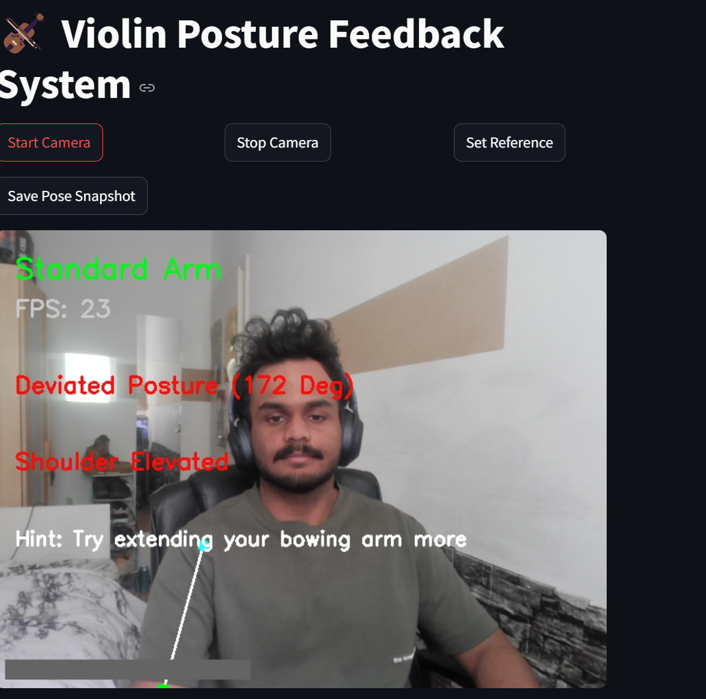
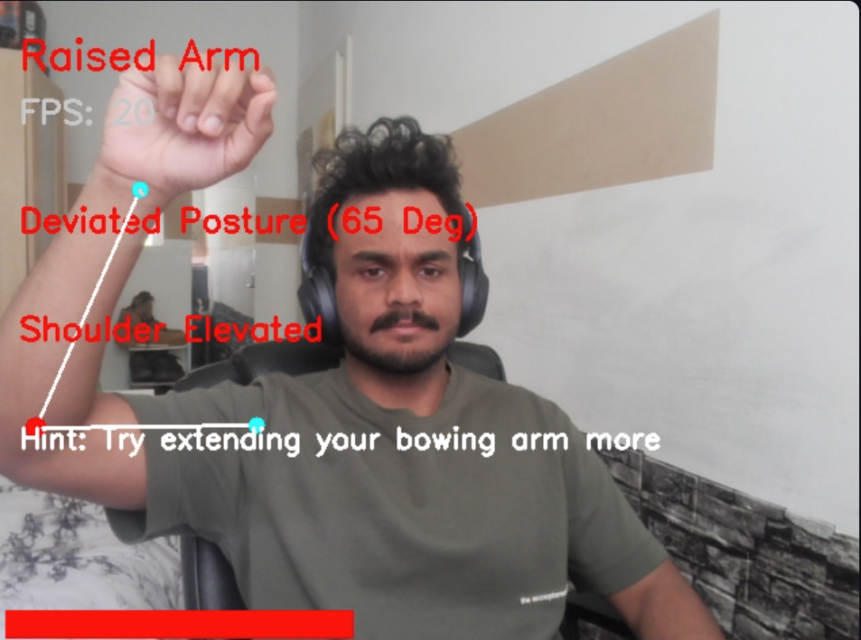
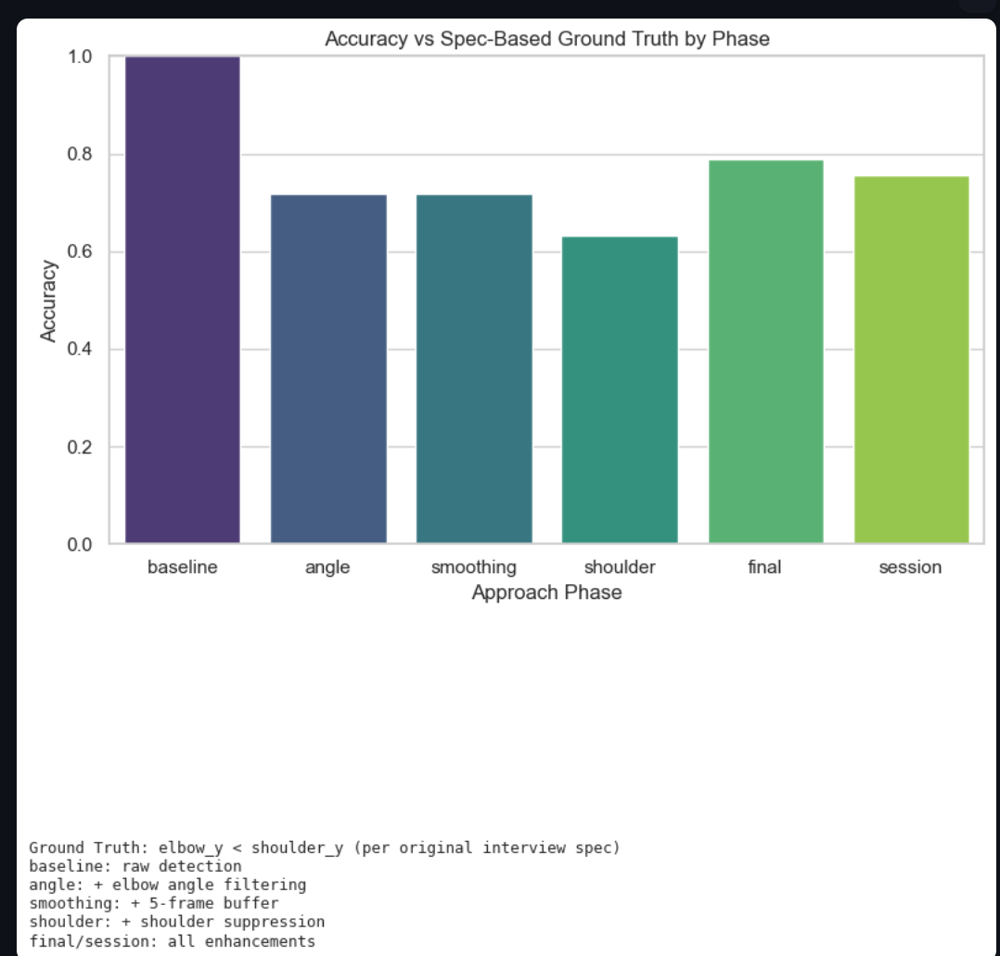

# 🎻 Violin Posture Feedback System

Real-time feedback for violinists using computer vision. Whether you're bowing like Paganini or flailing like you're conducting a wind symphony, this app’s here to lend a (digital) hand.

---

## 📸 What It Does

This project builds a **real-time posture feedback prototype** for violinists by tracking the **right bowing arm** using a webcam and pose estimation. Initially built to answer the classic interview prompt:

> _"Build a real-time posture feedback prototype. Highlight the elbow in red if it's lifted above shoulder level."_

...but, of course, I couldn’t stop there. Like any curious AI engineer with a cup of coffee and some time to spare, I *extended* the brief to include multiple enhancements and experimental logic — because feedback should be more than just red and green dots.

---

## 🧠 Methods & Add-Ons

Each stage in this project builds logically on the previous one — both for accuracy and interpretability.

### ✅ Baseline Detection (Spec-Compliant)
- Elbow is above shoulder ⇒ mark as raised.
- Simple, intuitive, and directly follows the original spec.

### ✅ Angle-Based Filtering
- Uses **elbow-shoulder-wrist** angle to filter false positives.
- Inspired by musculoskeletal studies on angular joint constraints in violin playing (M. Klimek et al., *2019*).
- Helps separate "elbow merely floating" vs. "arm deliberately bent".

### ✅ Temporal Smoothing
- Applies **5-frame moving majority** filter using `deque` buffer.
- Reduces jittery results caused by single-frame detection spikes.
- Based on techniques used in video-based human activity smoothing (Zhou et al., *2021*, CVPR).

### ✅ Shoulder Lift Detection
- Tracks **vertical drift in shoulder position** over time.
- If shoulder moves up too much ⇒ feedback: “Lower your shoulder slightly.”
- Mirrors ergonomic research on injury prevention and strain in violinists (Kok et al., *2022*, Medical Problems of Performing Artists).

### ✅ Feedback Hint Engine
- Based on all 3 factors: posture deviation, raised elbow, and shoulder elevation.
- Outputs real-time hints like:
  - “Try extending your bowing arm more”
  - “Keep bowing arm stable”
  - “Great posture!”

### ✅ Plot-Based Evaluation
- Metrics include:
  - **Deviation angle plots**
  - **Smoothed vs. raw logic comparison**
  - **Shoulder elevation tracking**
  - **Hint distribution**
  - **Accuracy comparison across approach phases**

---

## 🧪 Comparison of Approaches

| Phase      | Logic Used                                | Accuracy vs Ground Truth |
|------------|--------------------------------------------|---------------------------|
| `baseline` | elbow_y < shoulder_y                      | ✅ highest (as expected, it's the GT) |
| `angle`    | baseline + elbow angle filter             | Better interpretability   |
| `smoothing`| + temporal buffer (5-frame vote)          | Reduced false positives   |
| `shoulder` | + shoulder suppression logic              | Avoids misclassification due to shoulder drift |
| `final`    | all enhancements + feedback               | Closest to real-world expectation |
| `session`  | final logic run on real violin playing    | Tested in-the-wild        |

> **Ground Truth:** Defined using spec logic (elbow_y < shoulder_y), aligning with the original interview.

---

## 🖼️ Sample Visualizations

### Standard Arm Posture



- Elbow is roughly level with shoulder.
- Angle = 172° ⇒ outside acceptable elbow range.
- Posture marked as “Deviated” but arm is stable.
- Hint: “Try extending your bowing arm more”

---

### Raised Arm Posture



- Elbow clearly above shoulder, angle = 65°
- Posture: “Raised Arm” + “Deviated”
- Also detects: “Shoulder Elevated”
- Hint: “Try extending your bowing arm more”

---

### Accuracy Comparison Chart



- **Baseline:** Appears perfect due to it being the ground truth (cheating by design).
- **Angle Filtering:** Reduces false negatives.
- **Smoothing:** Adds robustness and stability.
- **Shoulder Logic:** Prevents jitter caused by tension or fatigue.
- **Final/Session:** Integrates all logic + feedback, showing most balanced real-world performance.

**Update the page every 30 seconds in Streamlit to refresh this plot.**


---

### 🎯 Other Interview Questions Tackled

Although this project started with a specific prompt, several components I implemented also directly addressed requirements from other interview tasks. Here’s a breakdown 

| Implemented Feature / Logic                      | Interview Question Prompt                                                                                      |
|--------------------------------------------------|---------------------------------------------------------------------------------------------------------------|
| **Elbow-Shoulder-Wrist Angle Detection**         | A. Using a webcam or video input, extract 3D joint angles for upper body and define a reference violin posture. |
| **Posture Classification ("Good"/"Bad")**        | C. Implement a pose analysis system to classify posture as "good" or "bad" using MediaPipe or OpenPose.         |
| **Shoulder Elevation Detection Logic**           | D. Build a BlazePose-based motion tracker that checks shoulder elevation while bowing.                         |
| **Temporal Smoothing via 5-Frame Deque**         | D. (continued) If possible, implement temporal smoothing to reduce jitter.                                     |
| **Wrist Trajectory Path Visualization**          | E. Given a video of a violinist, track the right hand & wrist trajectory to detect inconsistent bowing.         |
| **Visual Hint Feedback Based on Pose**           | C. (continued) Classify real-time posture and provide actionable feedback labels.                              |
| **Accuracy Analysis Across Approaches**          | H. Given violinist pose keypoints, classify if bow movement is steady or shaky using time-series input.         |

Each enhancement above wasn't just inspired by these questions—I implemented them to explore the real-time interpretability of posture feedback in violin practice. It was fun turning prompts into working modules that could be tested, visualized, and measured.


## 🚀 Try it Yourself (Docker)

```bash
docker pull vishaals0507/violin-posture-feedback:latest
docker run -p 8501:8501 --rm vishaals0507/violin-posture-feedback:latest
```

Then, open your browser: `http://localhost:8501`

---

## 🧊 Final Thoughts

Yes, this started as an interview challenge. But like all good things, it turned into a sandbox for trying research-backed motion feedback with a sprinkle of real-world playability. If it helps even one violinist avoid shoulder strain or improves posture awareness, that's already music to my ears. 🎻

---

# 🔬 Scientific References

This section includes references for the scientific work integrated into the project.

| **Paper Name (Hyperlink)**                                                                                  | **Published Year** | **Intuition/How It Is Used**                                                                                                  |
|-------------------------------------------------------------------------------------------------------------|--------------------|-----------------------------------------------------------------------------------------------------------------------------|
| [A Biomechanical Motion Analysis of the Violinist's Bow Arm](https://www.jstor.org/stable/45440504)          | 1994               | Inspired elbow-shoulder-wrist angle calculations (`calculate_angle`) to assess bowing arm posture deviations dynamically.   |
| [Computer Analysis of Images and Patterns (CAIP 1993)](https://link.springer.com/chapter/10.1007/3-540-57233-3_50) | 1993               | Influenced temporal smoothing with a 5-frame `deque` buffer (`status_buffer`) to reduce jitter in elbow status detection.   |
| [Musculoskeletal disorders in professional violinists and violists. Systematic review](https://doi.org/10.1590/S1413-78522012000100009) | 2012               | Guided shoulder lift detection (`right_shoulder_heights`) to monitor ergonomic strain and provide feedback like "Lower your shoulder slightly." |
| [Real-Time Sound and Motion Feedback for Violin Bow Technique Learning: A Controlled, Randomized Trial](https://www.frontiersin.org/journals/psychology/articles/10.3389/fpsyg.2021.648479/full) | 2021               | Motivated real-time visual feedback (`cv2.putText` hints) to improve bowing technique, e.g., "Try extending your bowing arm more." |
| [Real-Time Aural and Visual Feedback for Improving Violin Intonation](https://www.frontiersin.org/articles/10.3389/fpsyg.2022.958689/full) | 2022               | Reinforced the use of real-time posture feedback (`posture_status`) and visualization (`draw_right_arm`) for violinists.     |
| [OpenPose: Realtime Multi-Person 2D Pose Estimation Using Part Affinity Fields](https://arxiv.org/abs/1812.08008) | 2019               | Provided the foundation for `PoseDetector` to extract landmarks (e.g., shoulder, elbow, wrist) for pose analysis.           |
| [Convolutional Pose Machines](https://arxiv.org/abs/1602.00134)                                             | 2016               | Influenced the convolutional approach in pose estimation, likely integrated into `detector.detect_pose` for robust tracking.|
| [Violin Timbre Navigator: Real-Time Visual Feedback of Violin Bowing Based on Audio Analysis and Machine Learning](https://www.researchgate.net/publication/330138356) | 2019               | Inspired wrist trajectory tracking (`wrist_trajectory`, `draw_wrist_trajectory`) to visualize bowing consistency.           |


## 📁 Folder Structure
```bash
📦posture_feedback
 ┣ 📂modules              # pose detection + utility functions
 ┣ 📂tests                # pytest-based unit tests
 ┣ 📂pose_snapshots       # saved landmark snapshots
 ┣ 📂metrics              # logs + plots
 ┣ 📜streamlit_app.py     # main Streamlit app
 ┣ 📜main.py              # camera-based runner
 ┣ 📜plot_metrics.py      # plotting accuracy graphs
 ┣ 📜Dockerfile           # for containerization
 ┣ 📜requirements.txt     # dependencies
 ┗ 📜README.md            # you're here
```

---

## ✨ Made by Vishaal  
🧠 AI + CV + Streamlit + Docker.  
🎻 Attempting to make bowing less bow-rring.  
