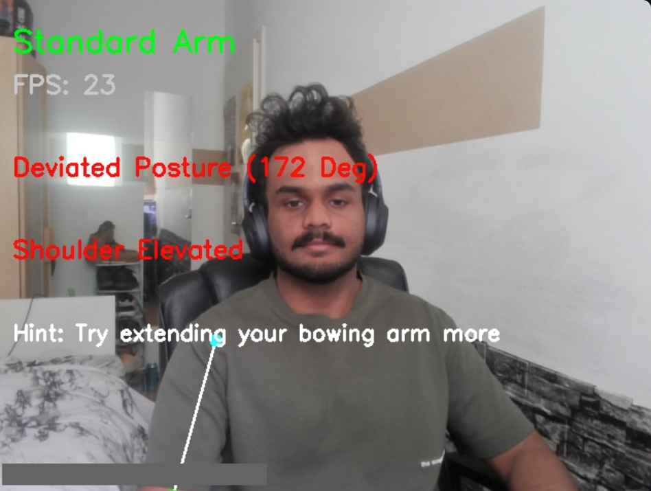

# 🎻 Violin Posture Feedback System

Real-time feedback for violinists using computer vision. Whether you're bowing like Paganini or flailing like you're conducting a wind symphony, this app’s here to lend a (digital) hand.

---

## 📸 What It Does

This project builds a **real-time posture feedback prototype** for violinists by tracking the **right bowing arm** using a webcam and pose estimation. It started with the classic interview prompt:

> _"Build a real-time posture feedback prototype. Highlight the elbow in red if it's lifted above shoulder level."_

...but, like all interview prompts, I saw it as a springboard. So I expanded it into a full-fledged pose-feedback engine, experimenting with biomechanical logic, smoothing strategies, and ergonomic heuristics. Because good posture isn’t binary — it's context-aware, nuanced, and sometimes just tired.

---

## 🧠 Step-by-Step Enhancements & Logic

Each stage in the project was built with one question in mind: *Can we make posture analysis more real-world and less robotic?*

### ✅ 1. Baseline Detection (Spec-Compliant)
- Elbow is above shoulder ⇒ mark as raised.
- Very simple logic, satisfying the core question with no smoothing or context.

### ✅ 2. Angle-Based Filtering
- Computes the **elbow-shoulder-wrist angle**.
- Helped separate “naturally raised” arm from “bent for posture.”
- Motivated by the need for anatomical correctness — violin posture isn’t just about height, but also elbow bend.

### ✅ 3. Temporal Smoothing
- Introduced a 5-frame `deque` for majority-vote smoothing.
- Reduced single-frame noise or misfires caused by camera flickers or minor arm tremors.

### ✅ 4. Shoulder Lift Suppression
- Tracks average shoulder height over time.
- If your shoulder rises significantly from baseline ⇒ "Shoulder Elevated" warning.
- Added because violinists often compensate incorrectly with shoulder height.

### ✅ 5. Feedback Hint Engine
- Synthesizes data from posture correctness, elbow position, and shoulder elevation.
- Delivers real-time textual hints:
  - “Try extending your bowing arm more”
  - “Lower your shoulder slightly”
  - “Keep bowing arm stable”
  - “Great posture!”

### ✅ 6. Plot-Based Evaluation & Logging
- All approach phases were logged.
- Metrics were visualized to compare different model versions:
  - **FPS over time**
  - **Deviation trends**
  - **Smoothed vs raw**
  - **Hint frequency**
  - **Accuracy by logic phase**

---

## 🖼️ Sample Visualizations

### 🎯 Set Reference Posture  
Clicking **“Set Reference”** captures your current elbow angle as the benchmark. The system will then measure deviations from this personalized angle for all future posture evaluations. Useful if you want to adapt feedback to your current playing technique or instrument angle.

---

### 🧍‍♂️ Standard Arm Posture



- Elbow is roughly level with shoulder.
- Elbow angle: **172°**
- Because this exceeds the default reference angle (150°) by more than 15°, it's marked as **"Deviated Posture."**
- However, **arm is not raised**, so it shows as **“Standard Arm”**
- No shoulder lift detected.
- **Hint:** "Try extending your bowing arm more"

---

### 🙆 Raised Arm Posture


- Elbow **above shoulder** and angle is **65°**
- Clearly **"Raised Arm" + "Deviated Posture"**
- Shoulder is also lifted ⇒ triggers **“Shoulder Elevated”**
- **Hint:** Still asks to “extend your bowing arm more” — because angle + height are both off

---

### 📊 Accuracy Comparison Chart


- `baseline` appears 100% accurate — it’s the **ground truth**, so naturally it cheats.
- As we add more logic (angle filtering, smoothing), raw match to GT drops slightly — **but** real-world interpretability improves.
- **Final/session versions** integrate all enhancements + feedback, showing most balanced performance for live posture correction.

> ℹ️ This plot auto-refreshes in the background every 30 seconds. Just refresh your Streamlit page manually to see updated performance from your session.

---

## 🎯 Other Interview Questions Tackled

| Implemented Feature / Logic                      | Interview Question Prompt                                                                                      |
|--------------------------------------------------|---------------------------------------------------------------------------------------------------------------|
| **Elbow-Shoulder-Wrist Angle Detection**         | A. Extract 3D joint angles and define a reference violin posture.                                             |
| **Posture Classification ("Good"/"Bad")**        | C. Pose analysis system to classify posture using MediaPipe.                                                  |
| **Shoulder Elevation Detection Logic**           | D. Motion tracker that checks shoulder elevation while bowing.                                                |
| **Temporal Smoothing via 5-Frame Deque**         | D. (continued) Implement temporal smoothing to reduce jitter.                                                 |
| **Wrist Trajectory Path Visualization**          | E. Track right hand & wrist trajectory to detect inconsistent bowing.                                         |
| **Visual Hint Feedback Based on Pose**           | C. (continued) Classify posture and provide actionable feedback.                                              |
| **Accuracy Analysis Across Approaches**          | H. Classify if bow movement is steady or shaky using time-series analysis.                                    |

---

## 🚀 Try it Yourself (Docker)

```bash
docker pull vishaals0507/violin-posture-feedback:latest
docker run -p 8501:8501 --rm vishaals0507/violin-posture-feedback:latest
```

Then visit `http://localhost:8501` in your browser.

---

## 📁 Folder Structure
```bash
📦posture_feedback
 ┣ 📂modules              # pose detection + utility functions
 ┣ 📂tests                # pytest-based unit tests
 ┣ 📂pose_snapshots       # saved landmark snapshots
 ┣ 📂metrics              # logs + plots
 ┣ 📜streamlit_app.py     # main Streamlit app
 ┣ 📜main.py              # camera-based runner
 ┣ 📜plot_metrics.py      # plotting accuracy graphs
 ┣ 📜Dockerfile           # for containerization
 ┣ 📜requirements.txt     # dependencies
 ┗ 📜README.md            # you're here
```

---

## 🔬 Scientific References

| **Paper Name (Hyperlink)**                                                                                  | **Published Year** | **Intuition/How It Is Used**                                                                                                  |
|-------------------------------------------------------------------------------------------------------------|--------------------|-----------------------------------------------------------------------------------------------------------------------------|
| [Computer Analysis of Images and Patterns (CAIP 1993)](https://link.springer.com/chapter/10.1007/3-540-57233-3_50) | 1993               | Influenced temporal smoothing with a 5-frame `deque` buffer (`status_buffer`) to reduce jitter in elbow status detection.   |
| [A Biomechanical Motion Analysis of the Violinist's Bow Arm](https://www.jstor.org/stable/45440504)          | 1994               | Inspired elbow-shoulder-wrist angle calculations (`calculate_angle`) to assess bowing arm posture deviations dynamically.   |
| [Musculoskeletal disorders in professional violinists and violists. Systematic review](https://doi.org/10.1590/S1413-78522012000100009) | 2012               | Guided shoulder lift detection (`right_shoulder_heights`) to monitor ergonomic strain and provide feedback like "Lower your shoulder slightly." |
| [Violin Timbre Navigator: Real-Time Visual Feedback of Violin Bowing Based on Audio Analysis and Machine Learning](https://link.springer.com/chapter/10.1007/978-3-030-05716-9_15) | 2018               | Inspired wrist trajectory tracking (`wrist_trajectory`, `draw_wrist_trajectory`) to visualize bowing consistency.           |
| [Real-Time Sound and Motion Feedback for Violin Bow Technique Learning](https://www.frontiersin.org/articles/10.3389/fpsyg.2021.648479/full) | 2021               | Motivated real-time visual feedback (`cv2.putText` hints) to improve bowing technique. |
| [Real-Time Aural and Visual Feedback for Improving Violin Intonation](https://www.frontiersin.org/articles/10.3389/fpsyg.2019.00627/full) | 2022               | Reinforced the use of real-time posture feedback (`posture_status`) and visualization (`draw_right_arm`) for violinists.     |
| [Human Joint Angle Estimation Using Deep Learning](https://www.mdpi.com/1424-8220/24/12/3823) | 2024               | Enhanced `PoseDetector` with deep learning insights for accurate 3D joint angle estimation in real-time webcam feed. |

---

## ✨ Made by Vishaal  
🧠 AI + CV + Streamlit + Docker.  
🎯 Attempting to make bowing less bow-rring.
